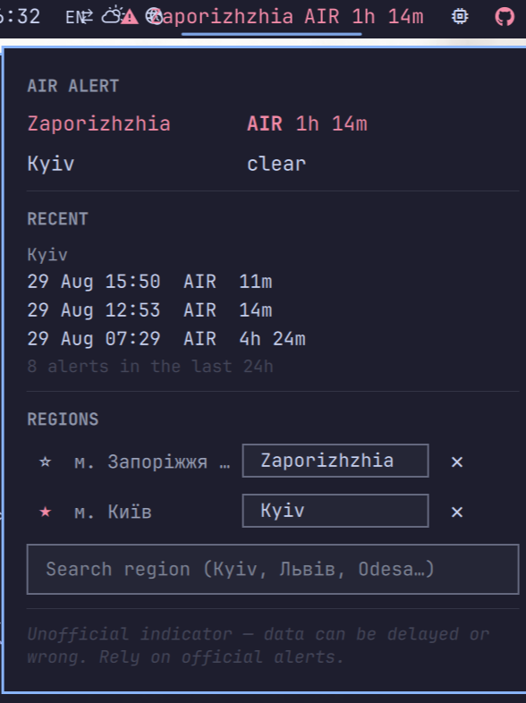

# Ukraine Air Alert

An Omarchy bar widget showing whether an air raid alert is active in the
regions of Ukraine you care about, which type it is, and how long it has been
running.



---

## ⚠ Disclaimer — read this first

**This is a convenience indicator. It is not a life-safety system, and it must
not be relied on as one.**

- **Not official.** This plugin is not affiliated with, endorsed by, or
  operated by the State Emergency Service of Ukraine, the Armed Forces, any
  oblast administration, or any other authority. It reads a free, unofficial,
  community-run third-party mirror.
- **It can be wrong.** Data can be delayed, incomplete, cached, or simply
  incorrect. The upstream service can go offline or return stale values with
  no indication that it has.
- **It can be silent when it matters.** Your machine may be asleep, offline,
  locked, on a dead battery, or showing a fullscreen window over the bar. The
  widget raises no notification and makes no sound **by design** — it cannot
  wake you and does not try to.
- **Absence of an alert here does not mean you are safe.** A network failure,
  a misconfigured region, or an upstream outage all look calmer than reality.
  The widget marks staleness where it can detect it, but it cannot detect
  everything.

**Use official channels for decisions about your safety** — the state air
alert app, oblast and municipal channels, and the physical sirens. Treat this
widget as a glance, never as the thing you act on.

Provided as-is, without warranty of any kind, as stated in the MIT licence.

---

## What it deliberately does not do

**No notifications. No sound.**

People living under these alerts already have phone apps and the actual street
sirens. A fourth thing shouting in the same room is noise, not signal. What a
desktop can usefully add is a quiet, always-visible answer to "is it on right
now, and how long has it been on" — so that is all this does.

## Data source

[`siren.pp.ua`](https://siren.pp.ua) — a free, keyless public mirror of the
official [UkraineAlarm](https://api.ukrainealarm.com) API.

**No API key, no registration, no account.** That is why this source was chosen
over [alerts.in.ua](https://alerts.in.ua), which has better data but issues
per-user tokens by request form and rate-limits hard — every person installing
this plugin would need their own token first.

Alert types reported: `AIR`, `ARTILLERY`, `URBAN_FIGHTS`, `CHEMICAL`,
`NUCLEAR`, `INFO`.

## Install

```bash
omarchy plugin add https://github.com/dfrost90/omarchy-ukraine-air-alert.git --enable
```

Then put it on the bar:

```bash
omarchy bar move io.github.dfrost90.air-alert --section right
```

## Removal

```bash
omarchy plugin remove io.github.dfrost90.air-alert
rm -f ~/.local/state/omarchy/settings/air-alert.json
rm -rf ~/.cache/omarchy/air-alert
```

Remove its entry from `bar.layout` in `~/.config/omarchy/shell.json` if you
added one by hand.

## Dependencies

| Dependency | Why |
|---|---|
| `curl` | Every HTTP request. |
| `jq` | JSON parsing and construction in `scripts/fetch-alerts`. |

Both ship with Omarchy. There is no AUR package, no Python, and no compiled
component.

## Permissions, data access and safety

- **Network:** outbound HTTPS to `siren.pp.ua` only. Nothing else is contacted.
- **What is sent:** the region ids you selected, in the URL path. No
  identifiers, no telemetry, no analytics, no user agent beyond curl's default.
- **Privileges:** none. No `sudo`, no `pkexec`, no setuid, no privileged
  helper, no system files touched.
- **Files written:** exactly two, both its own —
  `~/.local/state/omarchy/settings/air-alert.json` (your region choice) and
  `~/.cache/omarchy/air-alert/regions.json` (the cached region list). It never
  writes your Omarchy config; pinning regions in `shell.json` is something you
  do by hand, and the plugin only reads it.
- **What it reads:** its own two files, plus
  `~/.local/state/omarchy/settings/weather.json` — read once, only to pre-fill
  the region search box as a suggestion, and never acted on automatically.
- **Bounded input:** every network response and every file read is capped
  before it is retained, and a body that reaches its ceiling is refused whole
  rather than truncated — a truncated prefix of a hostile response can still
  parse as valid JSON and then be believed. Region counts, alert counts and
  catalog size are capped as well as byte length, because shape says nothing
  about how many QML objects a payload will build.
- **Text sinks:** every string that comes from the network or from a
  user-writable file is stripped of markup delimiters and truncated before it
  reaches a `Text`, including the tooltip — `Ui/PanelToolTip.qml`'s
  `contentItem` sets no `textFormat` and therefore inherits `AutoText`.
- **Region ids** are validated as digits before they reach a process argument
  or a URL.

## Choosing regions

Click the widget and type a region name. Both scripts work:

```
Kyiv      → м. Київ, Київська область
Львів     → Львівська область, Львівський район
Odesa     → Одеська область, Одеський район
```

Latin input is matched by romanizing the region list (KMU 2010), because the
API's region tree carries Ukrainian names only. Search also survives Ukrainian
adjectival forms, so `Odesa` finds `Одеська` and `Kremenchuk` finds
`Кременчуцький`.

Each result shows its type and parent oblast on a second line, since
`Львівська область` and `Львівський район` are otherwise indistinguishable.

You can watch several regions at once. Each gets an editable display label —
useful for showing an English name for a Ukrainian region — which never
changes which region is actually monitored.

### Which region the pill speaks for

With more than one region watched, a star appears beside each. The starred
region is the one the pill shows **when several are alerting at once**.

It never silences anything. If your starred region is clear and another
watched region is alerting, the pill shows that other region's alert, labelled
so you can see it is not your primary. You chose to watch it; hiding it would
be the same under-reporting the `~` marker exists to avoid.

Removing the starred region clears the star rather than leaving it dangling.

If your Omarchy weather location is set, the picker opens pre-filtered to it as
a **suggestion**. It is never applied on its own. Measured against the live
region list, romanized matching of 32 Ukrainian cities resolved 12 uniquely, 16
ambiguously and missed 4 — and for Kyiv specifically the match lands on
`Київська область` rather than `м. Київ`, a different region with different
alerts. The last click is yours.

Granularity is oblast and raion. Hromada-level regions exist in the API and can
be pinned by id in `shell.json`, but they are kept out of the picker: 1455
near-identical names would bury the 151 that are useful.

## Configuration

All optional. Pinning `regions` in `shell.json` overrides the picker.

```json
{
  "id": "io.github.dfrost90.air-alert",
  "regions": [
    { "id": "31", "label": "Kyiv" },
    { "id": "36", "label": "Vinnytskyi" }
  ],
  "primaryId": "31",
  "pollSeconds": 90,
  "staleAfterSeconds": 180,
  "icon": "󰀦"
}
```

| Key | Default | Meaning |
|---|---|---|
| `regions` | *(picker)* | Pinned regions, max 32. Overrides the picker's saved choice. |
| `primaryId` | *(picker)* | Region id the pill favours when several alert at once. Overrides the star, and hides it in the panel. |
| `pollSeconds` | `90` | Poll interval in seconds. Minimum 10. |
| `staleAfterSeconds` | `60` | How long without a successful fetch before the data counts as stale. Floored at `pollSeconds * 2`, so 180s at the default interval. |
| `icon` | `󰀦` | Bar glyph. |
| `maxLabelWidth` | `110` | Pixel ceiling on the region label in the pill before it elides. The alert type and elapsed time are never elided. |

Region ids: `./scripts/fetch-alerts --regions | jq -r '.regions[] | "\(.id)\t\(.name)"'`

## Reading the pill

| Shows | Meaning |
|---|---|
| glyph only | All watched regions clear, data fresh. |
| `AIR 1h 24m` | Alert active, with type and elapsed time. |
| `Kyiv AIR 1h 24m` | As above, labelled — shown when watching several regions. |
| `~AIR 1h 24m` | Alert active, but the data is stale. `~` marks the elapsed time as extrapolated from the last successful fetch. |
| `?` | Data is stale and the last known state was clear — the widget does not know. |
| `set region` | No region chosen yet. |

The important case is `~`. If the network drops during an alert the widget
keeps showing the alert rather than falling back to "unknown". Under-reporting
an active alert is the dangerous direction; over-reporting one is merely
annoying.

Hover for per-region detail and the age of the last successful update. Middle
click forces a refresh.

## How it polls

Every 90 seconds by default, and most ticks cost exactly one ~38-byte request
to `/api/v3/alerts/status` — a single integer that changes whenever anything
changes anywhere in Ukraine. Only when that integer moves does the widget fetch
the watched regions.

Steady state is therefore well under one request per minute. That matters
because this runs 24/7 against a free community service someone else pays for.

The trade is that an alert can be up to 90 seconds old before the pill changes.
That is deliberate: this is a passive indicator you glance at, not something
you find out from — see the disclaimer.

The mirror answers `429` after roughly five requests in quick succession, so
consecutive failures double the poll interval (capped at 5 minutes) until one
succeeds. A rate-limited or offline upstream is never polled at full speed.

Alert history is fetched only when the panel is opened, and cached for 60s.
The panel lists the three most recent alerts per region plus a count over the
last 24 hours — how many there have been says more than any single row.

## Tests

```bash
bash tests/run
```

229 assertions: the fetch script against a stubbed `curl` (no request leaves
the machine), and every pure function in `Model.js` under node.

## Licence

MIT — see [LICENSE](LICENSE).
